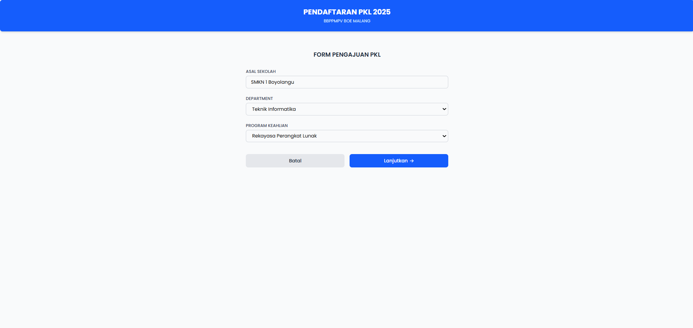
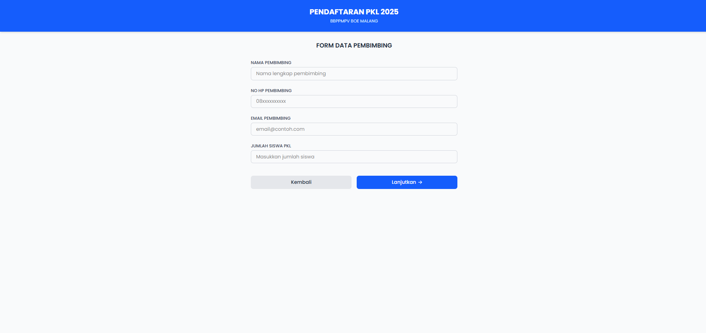
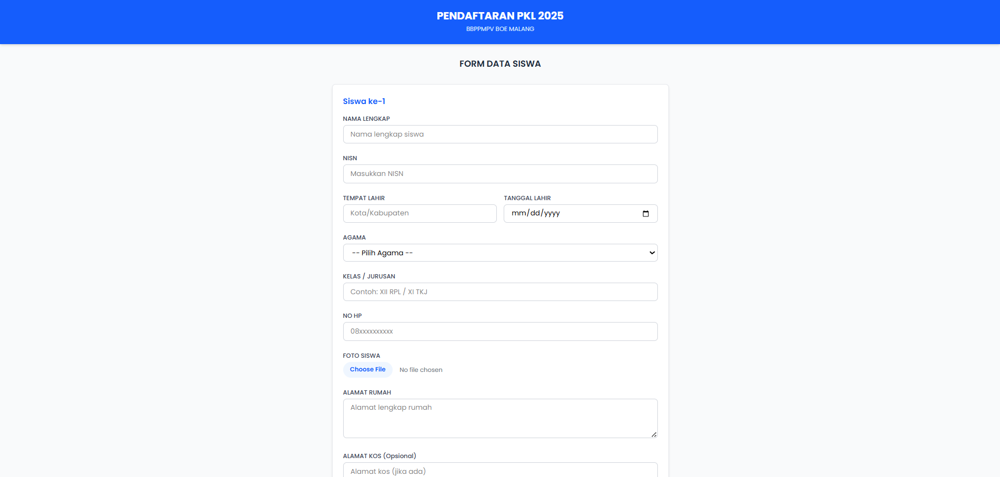

---

````markdown
# 🌐 Website Penerimaan Siswa PKL BOE Malang 2025
*Aplikasi Web untuk Penerimaan PKL di BBPPMPV BOE Malang*


---

## 📝 Tentang Website
Website ini dibuat untuk mendukung **proses penerimaan siswa PKL (Praktek Kerja Lapangan) di BBPPMPV BOE Malang tahun 2025**.  

### ✨ Fitur Utama
- 📝 Pendaftaran siswa secara online  
- 🏫 Manajemen data sekolah asal  
- 👨‍🏫 Manajemen pembimbing eksternal & internal  
- 📂 Upload surat pengajuan  

Website dikembangkan menggunakan **Laravel 10, Tailwind CSS, dan MySQL**.

---

## 🖼️ Tampilan Website

### 🔹 Halaman Form Pendaftaran


### 🔹 Halaman Form Pembimbing


### 🔹 Halaman Form Data Siswa


> 📌 Simpan semua gambar di folder `public/images/` agar otomatis tampil di README.

---

## ⚙️ Cara Instalasi & Menjalankan Project

1. Clone repository
   ```bash
   git clone https://github.com/mhmdfirza/Project-Website-Penerimaan-Magang-BBPPMPV-BOE.git
   cd Project-Website-Penerimaan-Magang-BBPPMPV-BOE
````

2. Install dependency Laravel

   ```bash
   composer install
   ```

3. Install dependency frontend

   ```bash
   npm install
   ```

4. Konfigurasi environment

   ```bash
   cp .env.example .env
   php artisan key:generate
   ```

5. Jalankan migrasi database

   ```bash
   php artisan migrate --seed
   ```

6. Jalankan server Laravel

   ```bash
   php artisan serve
   ```

7. Jalankan Vite

   ```bash
   npm run dev
   ```

---

## 📌 Teknologi yang Digunakan

* [Laravel 10](https://laravel.com/)
* [Tailwind CSS](https://tailwindcss.com/)
* [MySQL](https://www.mysql.com/)
* [Vite](https://vitejs.dev/)

---

## 👨‍💻 Kontributor

* Tim Developer BOE Malang
* [@mhmdfirza](https://github.com/mhmdfirza)
* [@VembiYusuf](https://github.com/VembiYusuf)

---

## 📜 Lisensi

Project ini menggunakan lisensi **MIT** – bebas digunakan, dimodifikasi, dan didistribusikan.

```

```
